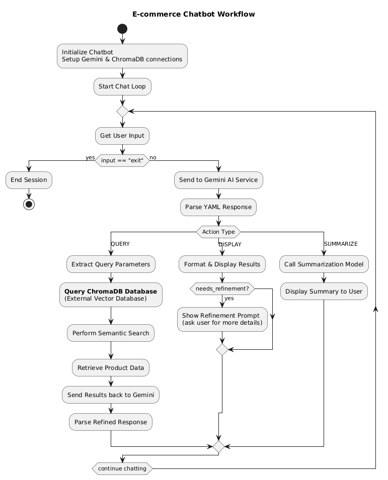
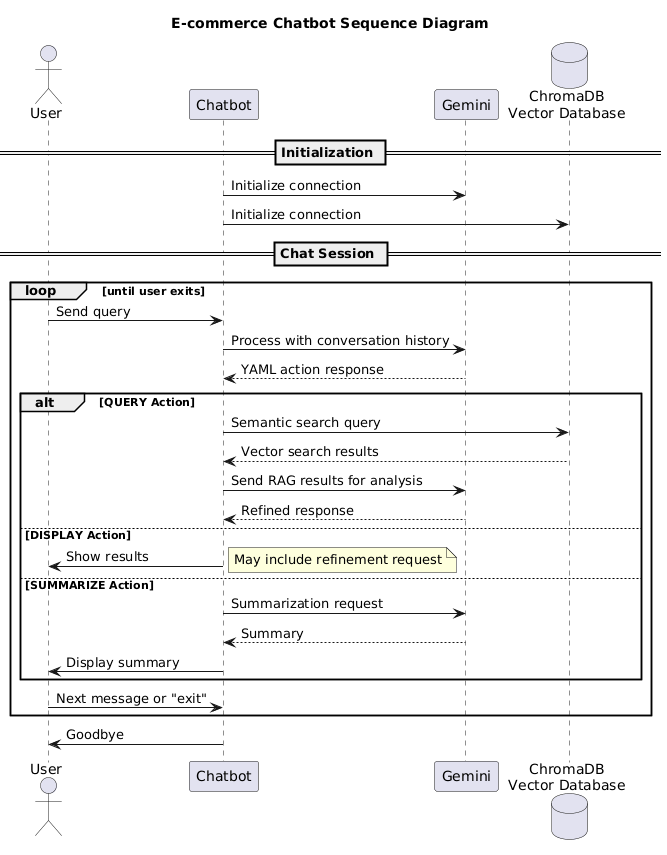

# E-commerce AI Chatbot

## Project Overview

This project implements an AI-powered e-commerce chatbot designed to provide product recommendations and information based on user queries. The chatbot leverages Google Gemini for natural language understanding and response generation, and a Retrieval-Augmented Generation (RAG) system using ChromaDB for accessing product metadata and reviews.

The chatbot uses Gemini's `system_instruction` to define its role and behavior, and relies on the model's built-in conversation history management to maintain context across interactions without manual prompt concatenation. Response generation follows a structured YAML format, enabling explicit actions like querying the RAG database, displaying information to the user, or summarizing retrieved data.

## Flow





## Current Chatbot Functionality

The chatbot provides an interactive command-line interface where users can engage in natural conversations about e-commerce products. It leverages Gemini's chat session capabilities to automatically maintain conversation history, eliminating the need to manually pass prior context with each prompt.

## Chatbot Pseudo Code

The refactored `chatbot.py` follows an object-oriented design with the following high-level structure:

```
Constants:
- PRODUCT_META_COLLECTION = "product_meta"
- PRODUCT_REVIEW_COLLECTION = "product_review"
- MAX_RETRIES = 3
- EXIT_COMMAND = "exit"

Helper Functions:
- parse_yaml_response(gemini_response): Parse YAML from AI response
- display_token_usage(metadata, label): Display API usage stats
- display_results(message, data, snippet_source, needs_refinement): Format and display chatbot responses

Class: EcommerceChatbot
    __init__():
        Initialize Gemini models and ChromaDB collections
        Start conversation session

    get_collection(collection_name):
        Return appropriate ChromaDB collection

    handle_query_action(parameters, user_input):
        Process QUERY action with RAG retrieval
        Send results back to Gemini for post-processing
        Handle DISPLAY/SUMMARIZE responses

    handle_display_action(parameters):
        Display information to user
        Handle refinement requests

    handle_summarize_action(parameters):
        Use cheaper model for summarization

    process_user_input(user_input):
        Send input to Gemini and parse YAML response
        Route to appropriate action handler
        Retry on YAML parsing errors

    start_chat():
        Main chat loop
        Handle user input and exit commands

Main Function:
    start_chat():
        Create EcommerceChatbot instance and start chat
```

Using a detailed `system_instruction` prompt ([`context_prompt.py`](context_prompt.py)), Gemini generates structured YAML responses to determine appropriate actions. Based on these instructions, the chatbot can:
*   **Query** ChromaDB vector stores for relevant product metadata or reviews.
*   **Display** information to the user, including product details and contextual snippets from customer reviews.
*   **Summarize** (currently prints a request for summarization) complex information, with potential for advanced summarization.

## Enhanced RAG Query Strategies

The chatbot's prompt has been enhanced to guide Gemini in generating more effective RAG queries by providing detailed information about the available ChromaDB collections and their fields, along with specific strategies:

*   **Collection Awareness:** Gemini is explicitly informed about the two collections (`product_meta` and `product_review`) and their respective fields.
*   **Semantic Relevance:** Queries are designed to capture the semantic meaning of user requests, mapping them to product attributes.
*   **Field-Specific Queries:** Gemini can now leverage specific fields like `main_category`, `title`, `price`, and `average_rating` from `product_meta` for targeted searches.
*   **Review Analysis:** The `product_review` collection is used for sentiment analysis and extracting specific feedback, linked via `parent_asin`.
*   **Iterative Refinement:** The chatbot supports iterative RAG by allowing Gemini to request clarifying questions (`needs_refinement: true`) when initial results are insufficient. When this occurs, the chatbot will prompt the user for more details, enabling a more targeted subsequent query. The chatbot now provides more context in its refinement prompts, helping users understand what information is needed to improve the search results.

## ChromaDB Collections

This project utilizes exactly two collections within ChromaDB for storing and retrieving product-related data:

1.  **`product_meta` Collection:**
    *   **Purpose:** Stores core metadata for each product.
    *   **Fields:**
        *   `main_category`: The primary category of the product (e.g., "Apparel", "Electronics").
        *   `title`: The name of the product.
        *   `average_rating`: The average customer rating for the product.
        *   `feature`: Key features of the product.
        *   `description`: A detailed description of the product.
        *   `price`: The price of the product.

2.  **`product_review` Collection:**
    *   **Purpose:** Stores customer reviews for products, enabling sentiment analysis and detailed feedback.
    *   **Fields:** (Specific fields may vary based on data ingestion, but typically include)
        *   `review_text`: The content of the customer review.
        *   `rating`: The rating given by the customer.
        *   `parent_asin`: An identifier linking the review to its product in the `product_meta` collection.
        *   `review_date`: The date the review was posted.

**Note:** The system is designed to strictly use only these two collections for RAG operations.

## Features

*   **Conversation History Management:** Gemini's chat session automatically maintains context across interactions, allowing natural, multi-turn conversations without manual history concatenation.
*   **System Instruction Guidance:** Uses a comprehensive `system_instruction` ([`context_prompt.py`](context_prompt.py)) to define chatbot behavior, available actions, and RAG strategies.
*   **Interactive Chat Loop:** Engages users in a continuous conversation for product discovery.
*   **YAML Structured Responses:** Gemini generates responses in a structured YAML format, defining explicit actions and parameters:
    *   `QUERY`: Initiates a search on the ChromaDB RAG database.
    *   `DISPLAY`: Presents information or asks clarifying questions to the user.
    *   `SUMMARIZE`: (Placeholder) Intended for summarizing extensive RAG results.
*   **RAG Integration with ChromaDB:** Utilizes two ChromaDB collections:
    *   `product_meta`: For general product information (title, category, price, description).
    *   `product_review`: For detailed product reviews.
*   **Contextual Snippets:** When displaying product recommendations or positive experiences, the chatbot includes relevant snippets from raw RAG data to explain the rationale.
*   **Iterative RAG:** Supports query refinement by prompting users for additional details when initial results are insufficient.
*   **Intelligent Summarization:** SUMMARIZE actions use AI classification to detect requests for comprehensive information (like "tell me more about X" or "what else can you tell me"), automatically gathering extensive data from both product collections (20+ products, 30+ reviews) and providing concise, conversational summaries in 3-4 sentences maximum.
*   **Preference Discovery:** Automatically identifies when DISPLAY responses contain user preference analyses (e.g., desired brands, price ranges, features) and suppresses refinement requests, improving conversational efficiency and user experience.
*   **AI-Powered Request Classification:** Leverages Gemini to intelligently classify summarization requests as requiring comprehensive multi-collection data gathering versus standard single-text summaries, enabling dynamic and context-aware information retrieval.
*   **Modular Configuration:** Gemini-specific configurations (including generation parameters, safety settings, and system instruction) are externalized into `gemini_config.py`.
*   **Token Usage Display:** Provides insights into resource consumption by displaying prompt and completion token counts for each Gemini response (debug mode).
*   **Cost-Optimized Summarization:** Employs a cheaper Gemini model for summarization tasks.
*   **Robust Error Handling:** Includes a retry mechanism for YAML parsing failures, graceful fallback parsing for malformed responses, and user-friendly error messages.

## Setup and Installation

1.  **Clone the repository:**
    ```bash
    git clone https://github.com/your-repo/ecommerce-ai.git
    cd ecommerce-ai
    ```

2.  **Create and activate a virtual environment (recommended):**
    ```bash
    python -m venv .venv
    # On Windows
    .venv\Scripts\activate
    # On macOS/Linux
    source .venv/bin/activate
    ```

3.  **Install dependencies:**
    ```bash
    pip install -r requirements.txt
    ```

## Testing

The project includes comprehensive tests using pytest. Tests are organized in the `tests/` directory following Python testing best practices.

### Running Tests

**Run all tests:**
```bash
pytest
```

**Run tests with coverage:**
```bash
pytest --cov=. --cov-report=html
```

**Run specific test categories:**
```bash
# Unit tests only (no external dependencies)
pytest -m "not integration"

# Integration tests (require ChromaDB)
pytest -m integration

# Run specific test file
pytest tests/test_chroma_db.py

# Run with verbose output
pytest -v
```

### Test Structure

```
tests/
├── __init__.py              # Makes tests a package
├── conftest.py              # Shared pytest fixtures
├── test_chroma_db.py        # ChromaDB configuration tests
└── test_chatbot.py          # Chatbot functionality tests
```

### Test Types

- **Unit Tests**: Test individual functions and classes without external dependencies
- **Integration Tests**: Test ChromaDB connectivity and real database operations (marked with `@pytest.mark.integration`)
- **Configuration Tests**: Verify ChromaDB setup and collection availability

## How to Run the Chatbot

To start the chatbot, execute the `chatbot.py` script:

```bash
python ecommerce-ai/chatbot.py
```

For debug mode (shows detailed Gemini responses and token usage):

```bash
python ecommerce-ai/chatbot.py -d
# or
python ecommerce-ai/chatbot.py --debug
```

The chatbot will greet you, and you can start typing your queries. Type `exit` to end the chat.

## Code Quality Improvements

The codebase has been significantly improved with modern Python techniques:

### **Type Safety & Structure**
- **Enums**: `ActionType` and `CollectionType` enums for type-safe action and collection handling
- **Data Classes**: Structured data classes (`GeminiResponse`, `QueryParameters`, `DisplayParameters`, `SummarizeParameters`) for better data organization
- **Type Hints**: Comprehensive type annotations throughout the codebase
- **Configuration Class**: Centralized configuration management with `ChatbotConfig`

### **Error Handling**
- **Custom Exceptions**: Specific exception classes (`ChatbotError`, `InvalidActionError`, `CollectionNotFoundError`, `GeminiAPIError`) for better error categorization
- **Graceful Degradation**: Proper fallback mechanisms and user-friendly error messages

### **Design Patterns**
- **Strategy Pattern**: Action handler mapping for extensible action processing
- **Protocol Classes**: Type-safe interfaces for action handlers
- **Configuration Management**: Centralized settings management

### **Testing Infrastructure**
- **Comprehensive Test Suite**: Unit tests for all major components
- **Integration Tests**: Database connectivity verification
- **Test Fixtures**: Shared test setup and mocking
- **CI/CD Ready**: Automated testing with coverage reporting

## Project Structure

```
ecommerce-ai/
├── chatbot.py              # Main chatbot logic with modern Python patterns (enums, dataclasses, type hints).
├── context_prompt.py       # System prompts and instructions for Gemini AI.
├── chroma_db_config.py     # ChromaDB connection and collection management.
├── gemini_config.py        # Google Gemini API configuration and model setup.
├── text_utils.py           # Text processing utilities for YAML extraction.
├── run_tests.py            # Convenient test runner script with options.
├── pytest.ini              # Pytest configuration and test settings.
├── requirements.txt        # Python dependencies including testing tools.
├── README.md               # Project documentation.
├── tests/                  # Comprehensive test suite
│   ├── __init__.py
│   ├── conftest.py         # Shared test fixtures and configuration
│   ├── test_chroma_db.py   # ChromaDB connectivity and configuration tests
│   └── test_chatbot.py     # Chatbot functionality and utility tests
├── chroma_db_processor/    # Data processing scripts for ChromaDB
│   ├── build_vector_db_cpu.py
│   └── build_vector_db_gpu.py
└── chromadbs/              # Persistent ChromaDB storage
    └── chromadb_v1/
        └── ...             # ChromaDB data files
```

## Future Enhancements / TODOs

*   use Gemini `tool` to get rid of YAML way to call internal functions
*   implement 'producer consumer' style to rebuilt chroma database